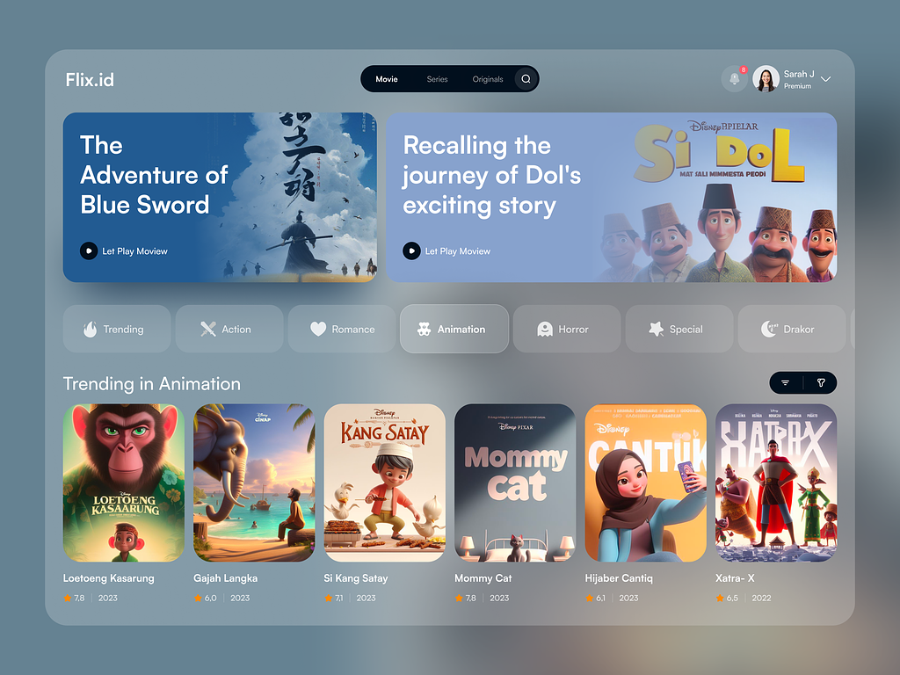

# Flix.id - Dockerized Web Application



*Gambar di atas adalah UI/UX dari proyek Flix.id.*

**Sumber Gambar**: https://dribbble.com/shots/23402774-Flix-id-Movie-Streaming-Dashboard-Exploration

Flix.id adalah aplikasi web untuk menampilkan dan mengelola film, serial, dan original content. Aplikasi ini terdiri dari backend berbasis Flask, frontend berbasis React, dan database PostgreSQL. Proyek ini menggunakan Docker dan Docker Compose untuk mempermudah setup dan deployment.

## Hasil Implementasi ke Frontend
_Screenshot_ berikut menunjukkan _User Interface_ Flix.id di frontend setelah aplikasi berhasil dijalankan. Dapat melihat berbagai fitur seperti daftar film, genre, serta tombol untuk menambahkan, mengedit, dan menghapus film.


## Struktur Proyek

```
flixid-app/
├── backend/                  # Backend berbasis Flask
│   ├── app.py                # File utama API Flask
│   ├── requirements.txt      # Dependency Python
│   └── Dockerfile            # Dockerfile untuk backend
├── frontend/                 # Frontend berbasis React
│   ├── src/                  # Kode sumber aplikasi React
│   └── Dockerfile            # Dockerfile untuk frontend
├── init.sql                  # Skrip inisialisasi database
├── docker-compose.yml        # File konfigurasi Docker Compose
└── README.md                 # Dokumentasi proyek
```

## Fitur

- **Frontend**: Dibangun dengan ReactJS dan TailwindCSS. Menyediakan antarmuka pengguna untuk menampilkan, mencari, menambahkan, mengedit, dan menghapus film.
- **Backend**: Dibangun dengan Flask dan terhubung ke database PostgreSQL. Menyediakan API REST untuk mengelola data film.
- **Database**: PostgreSQL dengan tabel `movies` untuk menyimpan informasi film.
- **Containerized**: Menggunakan Docker untuk memudahkan pengembangan, testing, dan deployment.

## Persyaratan

- **Docker** (https://docs.docker.com/get-docker/)
- **Docker Compose** (biasanya sudah disertakan dengan instalasi Docker)

## Cara Instalasi dan Menjalankan Proyek

1. **Clone Repository**:

   ```bash
   git clone https://github.com/rigelra15/flixid-web-app.git
   cd flixid-web-app
   ```

2. **Setup Docker Compose**:

   Pastikan file `docker-compose.yml` dan struktur proyek sudah sesuai.

3. **Jalankan Docker Compose**:

   Untuk membangun dan menjalankan semua service (backend, frontend, dan database), gunakan perintah berikut:

   ```bash
   docker-compose up --build
   ```

4. **Akses Aplikasi**:

   - **Frontend**: `http://localhost:8080`
   - **Backend API**: `http://localhost:5000`

## Struktur Database

Skrip `init.sql` digunakan untuk membuat tabel `movies` saat pertama kali container database dijalankan. Struktur tabelnya sebagai berikut:

```sql
CREATE TABLE movies (
  id SERIAL PRIMARY KEY,
  title VARCHAR(255) NOT NULL,
  overview TEXT,
  rating REAL,
  cover VARCHAR(255),
  genre VARCHAR(255),
  release_date DATE,
  duration INTEGER,
  category VARCHAR(255),
  age_rating VARCHAR(255),
  trailer VARCHAR(255),
  episode INTEGER
);
```

## API Endpoint

Backend Flask menyediakan endpoint berikut:

- `GET /`: Endpoint dasar untuk menguji koneksi.
- `GET /movies`: Mengambil semua data film.
- `POST /movies`: Menambahkan data film baru.
- `PUT /movies/<int:movie_id>`: Mengedit data film berdasarkan ID.
- `DELETE /movies/<int:movie_id>`: Menghapus data film berdasarkan ID.
- `GET /movies/search`: Mencari film melalui kolom pencarian
- `POST /upload`: Mengupload file cover film (_namun saat ini belum digunakan, hanya melalui URL Image saja_)

## Teknologi yang Digunakan

- **Frontend**: ReactJS, TailwindCSS
- **Backend**: Flask, Flask-CORS
- **Database**: PostgreSQL
- **Containerization**: Docker, Docker Compose

## Menambahkan atau Menghapus Modul

- **Backend**: Tambahkan modul Python di file `requirements.txt` dan rebuild container.
- **Frontend**: Tambahkan modul npm melalui `package.json` dan rebuild container.

## Troubleshooting

- **502 Bad Gateway**: Pastikan semua container telah berjalan, terutama container `backend`.
- **Database Connection Error**: Pastikan environment variable `DATABASE_URL` diatur dengan benar dan PostgreSQL telah dimulai.
- **Port Conflict**: Jika port 8080 atau 5000 sudah digunakan, Anda bisa menggantinya di file `docker-compose.yml`.